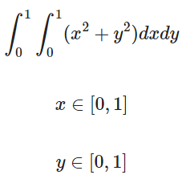

# potential-enigma-jl
Doing math things, especially numerical methods, in Julia

### Install the Julia environment

Julia dependencies for this repo need to be installed. From the root of this repo, type `julia`. At the prompt, type `]`. Then type the following:

```
(@v1.10) pkg> activate .
(potential-enigma-jl) pkg> instantiate
```

After the latter command finishes, type backspace, then:

```
julia> exit()
```

### Jupyter Notebooks for Quarto and Julia Jupyter Support

First, create a virtual environment for **Python** and install Jupyter Lab in it. This is required for Quarto builds of Julia. Run these commands from the root of the repo:

```
conda create --prefix env python=3.11
conda activate ./env
conda install jupyterlab
```

[See this page for additional guidance.](https://quarto.org/docs/projects/virtual-environments.html)

### The Julia Kernel for Jupyter

To run this part of the setup, the Python environment above should be activated so that Jupyter can install an additional kernel.

[First install IJulia according to these instructions.](https://julialang.github.io/IJulia.jl/stable/manual/installation/). In brief, the relevant commands are:

```
julia
using Pkg
Pkg.add("IJulia")
using IJulia
installkernel("Julia", "--project=@.")
```

### Quarto installation

[This only needs to be done once per machine for each upgrade of Quarto.](https://quarto.org/docs/get-started/)

### FINALLY! Check the Quarto installation

```
quarto check jupyter
```

If everything comes back good, especially finding a Julia kernel for Jupyter, you are ready!

## Metropolis Algorithm

### Overview of the demo

This is a demo of the Metropolis algorithm sampling a PDF that is the sum of three normal distributions.

### Running the demo

```
conda activate ./env
cd metropolis_basic
quarto render metropolis.qmd
```

Then open `metropolis.html` in a browser.

## Multivariate Normal Distribution

### Overview of the demo

This is a demo of a multivariate normal distribution from which random points on a two-diensional plane can be drawn. In this demo, I made the off-diagonal elements of the covariance matrix 0, so that the directions are uncorrelated with each other.

### Running the simulation

The following commands will render a Quarto document to HTML:

```
conda activate ./env
cd multivariate_normal_distribution
quarto render multivariate_normal.qmd
```

Then open `multivariate_normal.html` in a browser.

## Two-Dimensional Metropolis Algorithm

### Overview of the demo

This script uses a Metropolis algorithm to draw samples from a two-diensional PDF that is the sum of 3 multivariate normal distributions. It shows the original PDF as a contour plot and the samples as a two-dimensional histogram.

### Running the demo

```
cd metropolis_2d
julia --project=.. complicated_2d_pdf.jl
```

This will render two images. First is `2d_pdf.png` which is the contour plot of the PDF being sampled from. Second is `2d_pdf_samples.png` which is the histogram of samples drawn by the Metropolis algorithm.

## `cuda_monte_carlo_integration`
### Note
This script requires a system with NVIDIA CUDA drivers.
### Overview of the demo
This script performs Monte Carlo integration of:



The analytical solution is 2/3. The script produces 0.6662.
### Running the demo
Use the following commands to execute the demo:
```
cd .\cuda_monte_carlo_integration
julia --project=.. .\x2_plus_y2.jl
```

## Citations

The code in this repo uses [CUDA.jl](https://cuda.juliagpu.org/v2.2/) for GPU computations. Citations for this software are:

1. Besard, T., Churavy, V., Edelman, A. & Sutter, B. D. Rapid software prototyping for heterogeneous and distributed platforms. Advances in Engineering Software 132, 29–46 (2019).

2. Besard, T., Foket, C. & De Sutter, B. Effective Extensible Programming: Unleashing Julia on GPUs. IEEE Trans. Parallel Distrib. Syst. 30, 827–841 (2019).

